# Projektdokumentation - Homie

## Inhaltsverzeichnis

1. [Ausgangslage](#1-ausgangslage)
2. [Lösungsidee](#2-lösungsidee)
3. [Vorgehen & Artefakte](#3-vorgehen--artefakte)
    1. [Understand & Define](#31-understand--define)
    2. [Sketch](#32-sketch)
    3. [Decide](#33-decide)
    4. [Prototype](#34-prototype)
    5. [Validate](#35-validate)
4. [Erweiterungen](#4-erweiterungen)
5. [Projektorganisation](#5-projektorganisation)
6. [KI-Deklaration](#6-ki-deklaration)

> **Hinweis:** Massgeblich sind die im **Unterricht** und auf **Moodle** kommunizierten Anforderungen.

<!-- WICHTIG: DIE KAPITELSTRUKTUR DARF NICHT VERÄNDERT WERDEN! -->

<!-- Diese Vorlage ist für eine README.md im Repository gedacht. Abschnitte mit [Optional] können weggelassen werden, wenn in den Übungen nichts anderes verlangt wird. -->

## 1. Ausgangslage
Viele Menschen verlieren im Alltag schnell den Überblick darüber, welche Produkte zuhause noch vorhanden sind, was bald aufgebraucht ist und was beim nächsten Einkauf wirklich benötigt wird. Das betrifft nicht nur WGs, Paare oder Familien, sondern auch Einzelpersonen, die ihren Haushalt selbst organisieren. Einkaufslisten entstehen häufig über WhatsApp, mündliche Absprachen, Notizen oder im Kopf. Dadurch gehen Informationen schnell verloren, Produkte werden doppelt gekauft oder wichtige Dinge fehlen beim Einkauf.
Die Web-App Homie setzt genau hier an: Sie unterstützt sowohl Einzelpersonen als auch gemeinsame Haushalte dabei, Vorräte, Einkaufslisten, To-do’s und das Wochenmenü übersichtlich zu organisieren. So wird der Alltag besser strukturiert, Einkäufe können gezielter geplant werden und alle wichtigen Haushaltsinformationen sind an einem zentralen Ort verfügbar.

**Problem:** Es fehlt eine einfache, zentrale Lösung, mit der Einzelpersonen und gemeinsame Haushalte Vorräte, Einkaufslisten, Aufgaben und Mahlzeiten planen können. Dadurch entstehen Doppelkäufe, vergessene Produkte, unklare Absprachen und unnötige Verschwendung.  
**Ziele:** Ziel ist die Entwicklung einer intuitiven Web-App, mit der Nutzerinnen und Nutzer ihre Vorräte verwalten, Einkaufslisten erstellen, To-do’s organisieren und ein Wochenmenü planen können. Die App soll helfen, den Überblick im Alltag zu verbessern, Einkäufe gezielter zu planen, Lebensmittelverschwendung zu reduzieren und die Haushaltsorganisation zu vereinfachen.  
**Primäre Zielgruppe:** Die App richtet sich an Einzelpersonen sowie an Personen in gemeinsamen Haushalten wie WGs, Paare und Familien, die ihren Alltag besser organisieren möchten. Homie eignet sich somit für alle, die Vorräte, Einkäufe, Aufgaben und Mahlzeiten übersichtlich planen möchten.

## 2. Lösungsidee
Die entwickelte Web-App Homie ermöglicht es, Vorräte, Einkaufslisten, To-do’s und Wochenmenüs einfach und übersichtlich zu verwalten. Die App kann sowohl von Einzelpersonen als auch von mehreren Personen in einem gemeinsamen Haushalt genutzt werden. Über einen vierstelligen Haushalts-Code können Nutzerinnen und Nutzer einem Haushalt beitreten oder einen neuen Haushalt erstellen, ohne ein Benutzerkonto anlegen zu müssen. Dadurch bleibt der Einstieg bewusst unkompliziert und alltagstauglich.
Homie bündelt wichtige Funktionen der Haushaltsorganisation an einem zentralen Ort. Nutzerinnen und Nutzer können ihren Vorrat erfassen, Produkte nach Kategorien anzeigen lassen, Artikel auf die Einkaufsliste setzen und erledigte Einkäufe wieder in den Vorrat übernehmen. Zusätzlich unterstützt die App mit einer To-do-Liste und einem Wochenmenüplan die Planung des Haushaltsalltags.  
**Kernfunktionalität:**
    - Nutzung ohne klassisches Benutzerkonto oder Login
    - Verwaltung von Vorräten mit Artikelname, Menge, Einheit und Kategorie
    - Gruppierung der Vorräte nach Kategorien
    - Markierung von Artikeln, die bald leer sind
    - Übernahme von Artikeln aus dem Vorrat in die Einkaufsliste
    - Gemeinsame Einkaufsliste mit Hinzufügen, Anzeigen, Löschen und Übernehmen von Artikeln in den Vorrat
    - Speicherung von Mengenangaben und Einheiten wie Stück, Pack, kg, g, Liter oder eigener Angabe
    - To-do-Liste für Aufgaben im Haushalt
    - Wochenmenüplan mit Einträgen pro Wochentag
    - Möglichkeit, mehrere Menüeinträge pro Tag zu erfassen
    - Verschieben von Menüeinträgen per Drag & Drop
    - Automatische Speicherung der Daten in der Datenbank
    - Gemeinsamer Datenstand für alle Personen mit demselben Haushalts-Code  
**Annahmen:**
    - Eine einfache Lösung ohne komplexen Login wird eher genutzt als umfangreiche Systeme
    - Nutzerinnen und Nutzer bevorzugen eine schnelle, intuitive und mobile Bedienung
    - Ein gemeinsamer Haushalts-Code reicht aus, um Haushalte voneinander zu trennen
    - Die App wird hauptsächlich im Alltag nebenbei genutzt, zum Beispiel beim Einkaufen, Kochen oder Planen
    - Eine klare visuelle Struktur hilft dabei, den Überblick über Vorräte, Einkäufe und Aufgaben zu behalten
    - Die Kombination aus Vorrat, Einkaufsliste, To-do’s und Wochenmenü deckt zentrale Bedürfnisse der Haushaltsorganisation ab  
**Abgrenzung:**
    - Keine Benutzerkonten oder Login-Systeme
    - Keine detaillierte Rechteverwaltung (alle im Haushalt haben dieselben Rechte)
    - Keine automatische Erkennung von Produkten oder Barcode-Scan
    - Keine komplexe Lagerverwaltung oder Statistiken
    - Fokus liegt auf einfacher Funktionalität, nicht auf Vollständigkeit

## 3. Vorgehen & Artefakte
Die Entwicklung des Projekts erfolgte in mehreren Phasen. Zu Beginn wurde das Problem der Haushaltsorganisation im Alltag analysiert. Ursprünglich lag der Fokus der Idee auf zwei zentralen Funktionen: der Verwaltung von Vorräten und einer gemeinsamen Einkaufsliste. Damit sollte zuerst das Kernproblem gelöst werden, nämlich den Überblick über vorhandene Produkte und benötigte Einkäufe zu verbessern.
Während der Weiterentwicklung wurde deutlich, dass Haushaltsorganisation mehr umfasst als nur Vorräte und Einkäufe. Deshalb wurde die App schrittweise erweitert. Es kamen ein Dashboard als zentrale Übersichtsseite, eine To-do-Liste für Aufgaben im Haushalt sowie ein Wochenmenüplan zur Essensplanung hinzu. Dadurch entwickelte sich Homie von einer einfachen Vorrats- und Einkaufslisten-App zu einer umfassenderen Lösung für die alltägliche Organisation im Haushalt.
Anschliessend wurden die Funktionen schrittweise als Prototyp umgesetzt und laufend angepasst. Im Fokus standen eine einfache Bedienung, eine klare visuelle Struktur und die Möglichkeit, die App sowohl alleine als auch gemeinsam in einem Haushalt zu nutzen.
Das Vorgehen orientierte sich an einem Design-Thinking-ähnlichen Prozess. Dabei standen die Bedürfnisse der Nutzerinnen und Nutzer im Mittelpunkt. Ziel war es, eine Lösung zu entwickeln, die nicht nur technisch funktioniert, sondern auch im Alltag verständlich, schnell nutzbar und hilfreich ist.

### 3.1 Understand & Define
**Zielgruppenverständnis:** In der ersten Phase wurde untersucht, in welchen Alltagssituationen Menschen den Überblick über ihre Haushaltsorganisation verlieren. Dabei zeigte sich, dass das Problem nicht nur gemeinsame Haushalte betrifft, sondern auch Einzelpersonen. Neben Vorräten und Einkaufslisten spielen im Alltag auch Aufgaben im Haushalt und die Essensplanung eine wichtige Rolle.
Bei Einzelpersonen entsteht das Problem häufig dadurch, dass Einkäufe spontan geplant werden und vorhandene Produkte nicht bewusst überprüft werden. Man kauft zum Beispiel ein Produkt nochmals, obwohl es zuhause noch vorhanden ist, oder vergisst wichtige Dinge, weil keine aktuelle Einkaufsliste geführt wird. Auch Aufgaben oder geplante Mahlzeiten werden oft nur im Kopf behalten oder auf einzelnen Notizen festgehalten.
In gemeinsamen Haushalten ist das Problem zusätzlich komplexer, weil mehrere Personen Produkte verbrauchen, einkaufen oder Aufgaben übernehmen. Dadurch entstehen Missverständnisse: Eine Person geht davon aus, dass ein Produkt noch vorhanden ist, während eine andere es bereits aufgebraucht hat. Einkaufslisten oder Aufgaben werden oft über verschiedene Kanäle geführt, zum Beispiel über WhatsApp oder mündliche Absprachen. Dadurch ist der aktuelle Stand nicht für alle klar ersichtlich.

**Proto-Persona 1: Einzelperson**  
**Name:** Thomas  
**Alter:** 39 Jahre  
**Situation:**  Lebt alleine in einer Wohnung  
**Bedürfnis:** Thomas möchte beim Einkaufen besser wissen, welche Produkte er noch zuhause hat, welche Aufgaben anstehen und was er in der Woche kochen möchte.  
**Problem:** Er kauft oft Dinge doppelt oder vergisst wichtige Produkte, weil er keine feste Einkaufsliste führt. Zusätzlich plant er Mahlzeiten spontan und verliert dadurch manchmal den Überblick über vorhandene Lebensmittel.  
**Ziel:** Eine einfache App nutzen, mit der er Vorräte, fehlende Produkte, Aufgaben und Mahlzeiten schnell erfassen kann.  

**Proto-Persona 2: Gemeinsamer Haushalt**  
**Name:** Lara  
**Alter:**  24 Jahre  
**Situation:** Lebt in einer WG mit drei Mitbewohnerinnen und Mitbewohnern  
**Bedürfnis:** Lara möchte schnell sehen können, welche Produkte im Haushalt vorhanden sind, was noch gekauft werden muss, welche Aufgaben offen sind und welche Mahlzeiten geplant sind.  
**Problem:** In ihrer WG werden Einkaufslisten und Aufgaben oft über WhatsApp geführt. Dadurch gehen Nachrichten unter, Produkte werden mehrfach gekauft oder Aufgaben bleiben unklar verteilt.  
**Ziel:** Eine gemeinsame App nutzen, in der alle WG-Mitglieder denselben aktuellen Stand zu Vorräten, Einkaufsliste und Aufgaben sehen.

**Wesentliche Erkenntnisse:**
    - Die App muss sowohl für Einzelpersonen als auch für gemeinsame Haushalte funktionieren.
    - Die Bedienung muss sehr einfach und schnell verständlich sein.
    - Ein klassischer Login könnte für eine kleine Haushalts-App unnötig kompliziert wirken.
    - Eine gemeinsame Nutzung über einen Haushalts-Code senkt die Einstiegshürde.
    - Vorräte, Einkaufsliste und To-do’s sollten in gemeinsamen Haushalten zentral und für alle sichtbar sein.
    - Der Wochenmenüplan ist besonders für Einzelpersonen oder Haushalte sinnvoll, in denen gemeinsam geplant wird.
    - In WGs kann der Wochenmenüplan weniger relevant sein, da viele Personen ihre Mahlzeiten individuell planen.
    - Vorräte und Einkaufsliste sollten klar voneinander getrennt sein.
    - Kategorien verbessern die Übersichtlichkeit im Vorrat.
    - Mengenangaben und Einheiten sind wichtig, damit Artikel genauer erfasst werden können.
    - Die App sollte besonders auf mobilen Geräten gut nutzbar sein.
    - Der Fokus soll auf Alltagstauglichkeit liegen.
    - Wenige, gut funktionierende Kernfunktionen sind wichtiger als zu viele komplexe Zusatzfunktionen.

### 3.2 Sketch
**Variantenüberblick:** In der Sketch-Phase wurden verschiedene Möglichkeiten überlegt, wie die App aufgebaut sein könnte. Dabei wurde besonders darauf geachtet, dass die App sowohl für Einzelpersonen als auch für gemeinsame Haushalte verständlich bleibt. Zu Beginn lag der Fokus auf Vorräten und Einkaufsliste. Später wurde die Idee erweitert, sodass auch ein Dashboard, To-do’s und ein Wochenmenüplan berücksichtigt wurden.

**Variante 1: Einfache Listenansicht**
In dieser Variante werden alle Artikel in einer einfachen Liste dargestellt. Nutzerinnen und Nutzer können Produkte hinzufügen und löschen.

**Vorteile:**
- Sehr einfach verständlich
- Schneller Einstieg
- Wenig Ablenkung

**Nachteile:**
- Bei vielen Produkten schnell unübersichtlich
- Keine klare Trennung zwischen Vorräten und Einkaufsliste
- Für gemeinsame Haushalte weniger strukturiert
- Keine zentrale Übersicht über Aufgaben oder Planung

**Variante 2: Getrennte Bereiche für Vorrat und Einkaufsliste**
Diese Variante trennt die App in zwei Hauptbereiche: Vorräte und Einkaufsliste. Dadurch ist klar ersichtlich, welche Produkte bereits vorhanden sind und welche noch gekauft werden müssen.

**Vorteile:**
- Gute Übersicht
- Klare Struktur
- Für Einzelpersonen und Gruppen geeignet
- Einfache Bedienung
  
**Nachteile:**
- Etwas mehr Navigation notwendig als bei einer einzigen Liste

**Variante 3: Haushalts-Dashboard mit Code-Zugang**
Diese Variante sieht ein zentrales Haushalts-Dashboard mit Code-Zugang vor. Von dort aus sind Vorrat, Einkaufsliste, To-do-Liste und Wochenmenü erreichbar.

**Vorteile:**
- Gemeinsame Nutzung ohne Login möglich
- Auch Einzelpersonen können einen eigenen Haushalt verwenden
- Klare Trennung der Funktionen
- Zentrale Übersicht über Haushalt, Einkauf, Aufgaben und Planung
- Einfacher Einstieg
- Gut erweiterbar
- Unterstützt unterschiedliche Nutzungssituationen, zum Beispiel Einzelperson, Paar, Familie oder WG

**Nachteile:**
- Der Code muss bekannt sein oder gemerkt werden
- Keine individuelle Benutzerverwaltung

**Skizzen:**
Für die App wurden mehrere grobe Skizzen erstellt.

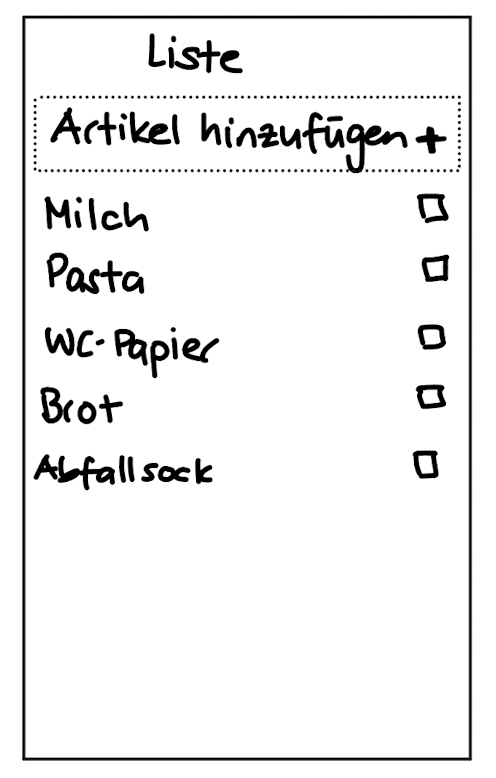
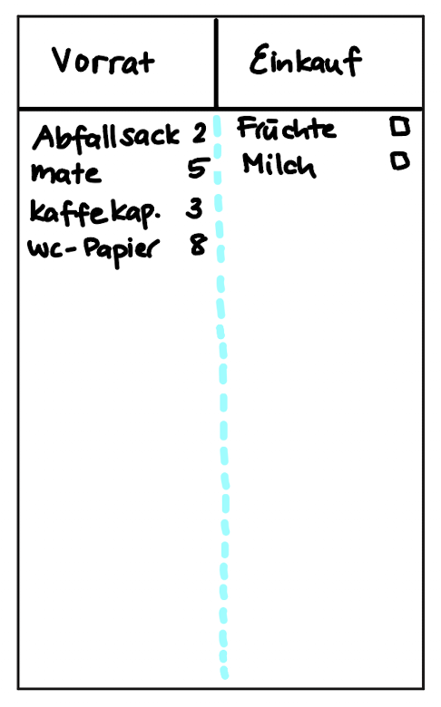
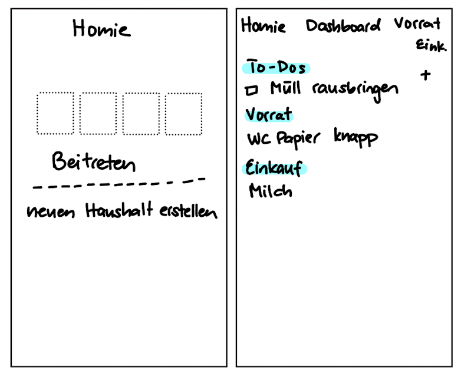

 *Skizzen*

Die Skizzen halfen dabei, die Struktur der App früh zu überprüfen. Besonders wichtig war, dass Nutzerinnen und Nutzer schnell verstehen, wo sie Produkte hinzufügen, fehlende Artikel eintragen, Aufgaben erfassen und Mahlzeiten planen können.

### 3.3 Decide
**Gewählte Variante & Begründung:** Nach dem Vergleich der verschiedenen Varianten wurde die Variante „Haushalts-Dashboard mit Code-Zugang“ ausgewählt. Diese Lösung verbindet eine einfache Bedienung mit der Möglichkeit, die App sowohl alleine als auch gemeinsam in einem Haushalt zu nutzen. Der vierstellige Haushalts-Code wurde gewählt, weil dadurch kein klassisches Login-System notwendig ist. Das senkt die Einstiegshürde und macht die App besonders schnell nutzbar.

Die Entscheidung fiel auf diese Variante, weil sie die wichtigsten Anforderungen des Projekts am besten erfüllt:
- einfache Nutzung ohne Registrierung
- Nutzung für Einzelpersonen und gemeinsame Haushalte
- gemeinsamer Zugriff für mehrere Personen über denselben Haushalts-Code
- klare Trennung zwischen Vorräten, Einkaufsliste, To-do’s und Wochenmenü
- gute Übersicht durch Kategorien im Vorrat
- zentrale Startansicht durch das Dashboard
- einfache Erweiterbarkeit für spätere Funktionen
- geeignet für mobile Nutzung im Alltag

**End-to-End-Ablauf:** Der typische Ablauf beginnt damit, dass eine Nutzerin oder ein Nutzer die Web-App öffnet. Auf der Startseite wird ein vierstelliger Haushalts-Code eingegeben. Falls der Haushalt bereits existiert, tritt die Person diesem Haushalt bei. Falls noch kein Code vorhanden ist, kann ein neuer Haushalt erstellt werden.
Nach dem Beitritt gelangt die Person zur Hauptansicht, dem Dashboard. Dort sind die wichtigsten Bereiche sichtbar: To-do’s, Einkaufsliste, bald leere Vorratsartikel und der Wochenmenüplan. Von dort aus kann die Person in die einzelnen Bereiche wechseln.
Im Vorratsbereich können vorhandene Produkte mit Namen, Menge, Einheit und Kategorie hinzugefügt werden. Die Produkte werden nach Kategorien gruppiert angezeigt. Wenn die Menge eines Vorratsprodukts auf 1 sinkt, wird es als bald leer erkennbar und kann mit einem Klick zur Einkaufsliste hinzugefügt werden.
In der Einkaufsliste können fehlende Produkte eingetragen, angezeigt, gelöscht und nach dem Einkauf wieder in den Vorrat übernommen werden. Dabei werden Mengenangaben und Einheiten mitgeführt, sodass die Informationen nicht erneut eingegeben werden müssen.
Zusätzlich können in der To-do-Liste Haushaltsaufgaben erfasst und erledigt werden. Der Wochenmenüplan ermöglicht es, Mahlzeiten für einzelne Wochentage einzutragen. Pro Tag können auch mehrere Menüeinträge erfasst und per Drag & Drop verschoben werden. Dadurch unterstützt die App nicht nur den Einkauf, sondern auch die Planung des Haushaltsalltags.

**User Journey:** 
1. Nutzerin oder Nutzer öffnet die Web-App.
2. Auf der Startseite wird ein vierstelliger Haushalts-Code eingegeben.
3. Falls der Haushalt bereits existiert, tritt die Person diesem Haushalt bei.
4. Falls noch kein Code vorhanden ist, erstellt die Person zuerst einen neuen Haushalt.
5. Nach dem Beitritt gelangt die Person zum Dashboard.
6. Im Dashboard sieht die Person eine Übersicht über To-do’s, Einkaufsliste, bald leere Artikel und Wochenmenü.
7. Im Vorratsbereich können Produkte mit Name, Menge, Einheit und Kategorie hinzugefügt werden.
8. Die vorhandenen Produkte werden nach Kategorien gruppiert angezeigt.
9. Produkte können bearbeitet, gelöscht oder in ihrer Menge angepasst werden.
10. Wenn die Menge eines Vorratsprodukts auf 1 sinkt, kann es mit einem Klick zur Einkaufsliste hinzugefügt werden.
11. In der Einkaufsliste können fehlende Produkte hinzugefügt, angezeigt oder gelöscht werden.
12. Nach dem Einkauf kann ein Produkt aus der Einkaufsliste wieder in den Vorrat übernommen werden.
13. Mengenangaben und Einheiten werden dabei übernommen.
14. In der To-do-Liste können Haushaltsaufgaben eingetragen und erledigt werden.
15. Im Wochenmenüplan können Mahlzeiten pro Wochentag eingetragen werden.
16. Pro Tag können mehrere Menüeinträge erstellt werden.
17. Menüeinträge können per Drag & Drop zwischen Tagen verschoben werden.
18. Alle Daten werden automatisch in der Datenbank gespeichert.
19. Alle Personen im Haushalt sehen denselben aktuellen Stand und können gemeinsam Vorräte, Einkäufe und Aufgaben verwalten.

**Mockup:** Das Mockup zeigt die wichtigsten Ansichten der App Homie: Login, Dashboard, Vorrat und Einkaufsliste. Es verdeutlicht, wie Nutzerinnen und Nutzer einem Haushalt beitreten, Vorräte verwalten und bald leere Produkte zur Einkaufsliste hinzufügen können.

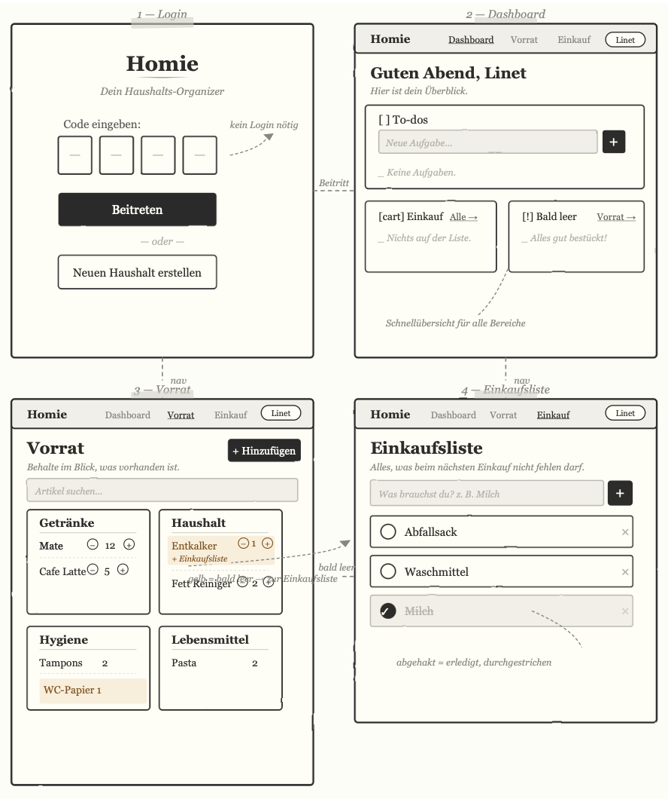

 *Mockup Homie*

### 3.4 Prototype

#### 3.4.1. Entwurf (Design)
Der Prototyp von Homie wurde so gestaltet, dass die wichtigsten Funktionen schnell verständlich und einfach erreichbar sind. Der Fokus liegt auf einer klaren Struktur, einer einfachen Bedienung und einer alltagstauglichen Nutzung auf Desktop und mobilen Geräten. Nutzerinnen und Nutzer sollen ohne lange Erklärung verstehen, wo sie Vorräte, Einkaufslisten, Aufgaben und das Wochenmenü verwalten können.
**Informationsarchitektur:**  Die App ist in wenige zentrale Bereiche aufgeteilt. Nach dem Öffnen der Web-App gelangen Nutzerinnen und Nutzer zuerst zur Startseite. Dort können sie entweder einen bestehenden vierstelligen Haushalts-Code eingeben oder einen neuen Haushalt erstellen.
Nach dem Beitritt zu einem Haushalt öffnet sich das Dashboard. Dieses bildet die Hauptansicht der App und zeigt die wichtigsten Informationen auf einen Blick. Von dort aus sind die zentralen Bereiche erreichbar:
- Vorräte
- Einkaufsliste
- To-do-Liste
- Wochenmenüplan

Der Bereich Vorräte dient dazu, vorhandene Haushaltsprodukte zu verwalten. Produkte können mit Name, Menge, Einheit und Kategorie erfasst werden. Die Artikel werden nach Kategorien gruppiert, damit auch bei mehreren Produkten eine gute Übersicht erhalten bleibt.
Die Einkaufsliste zeigt Produkte, die gekauft werden müssen. Artikel können hinzugefügt, gelöscht und nach dem Einkauf wieder in den Vorrat übernommen werden. Mengenangaben und Einheiten werden dabei mitgeführt, damit Informationen nicht erneut eingegeben werden müssen.
Die To-do-Liste ermöglicht es, zusätzliche Aufgaben im Haushalt einzutragen und zu erledigen.
Der Wochenmenüplan unterstützt die Essensplanung für die aktuelle Kalenderwoche. Pro Wochentag können ein oder mehrere Menüeinträge erfasst werden. Menüeinträge können ausserdem per Drag & Drop zwischen den Tagen verschoben werden.
Diese Struktur wurde gewählt, weil sie den Alltag in einem Haushalt einfach abbildet: Was ist vorhanden, was muss gekauft werden, was muss erledigt werden und welche Mahlzeiten sind geplant?

**User Interface Design:** Die folgenden Screenshots zeigen die wichtigsten Ansichten der Homie-App.

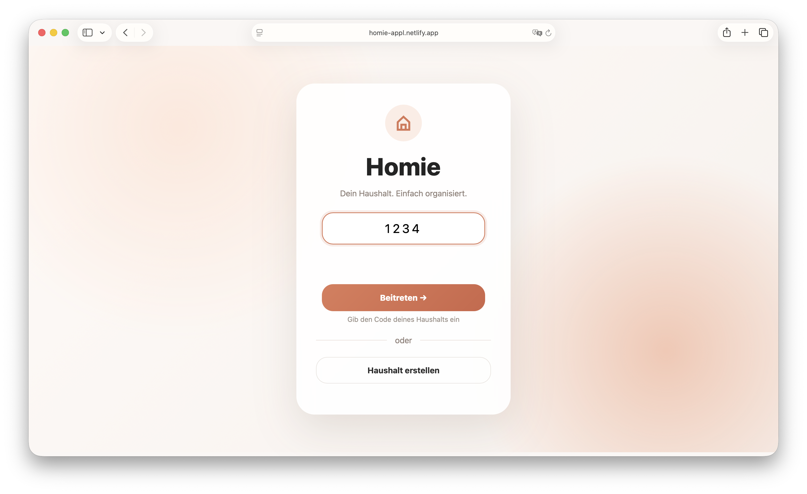
*Startseite der App, auf der Nutzerinnen und Nutzer einem Haushalt per Code beitreten können.*

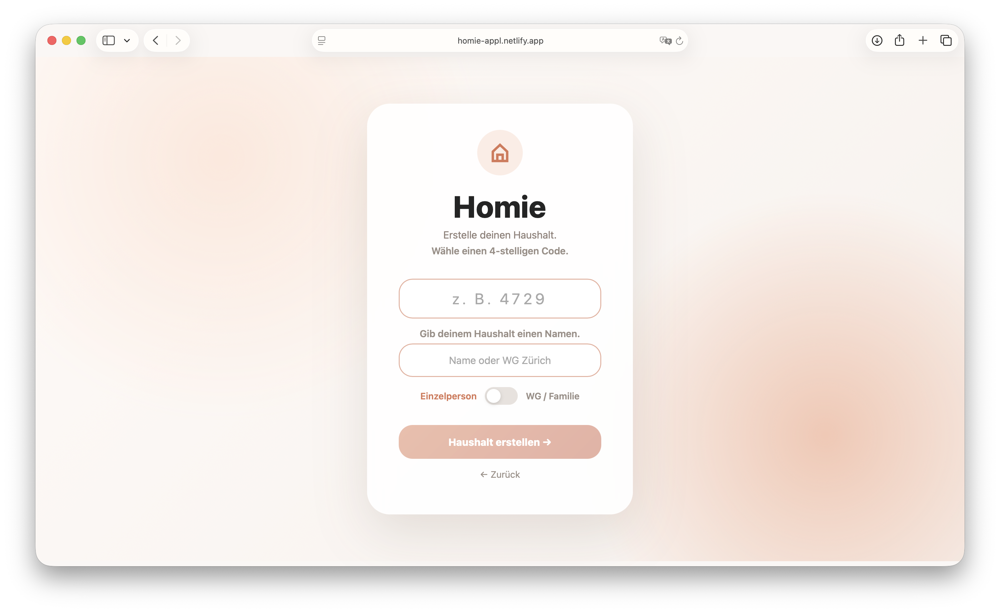
 *Ansicht zum Erstellen eines neuen Haushalts.*

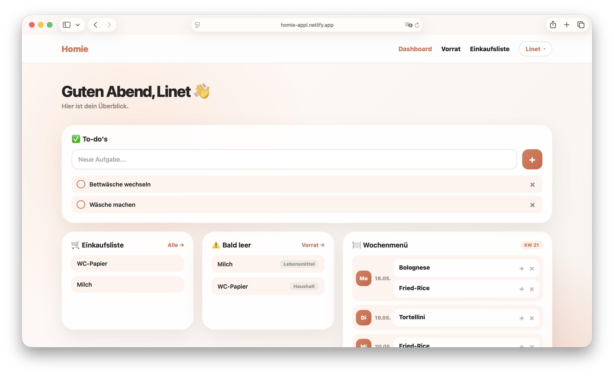
*Dashboard mit Übersicht über Vorräte, Einkaufsliste, To-do-Bereich und Wochenmenü.*

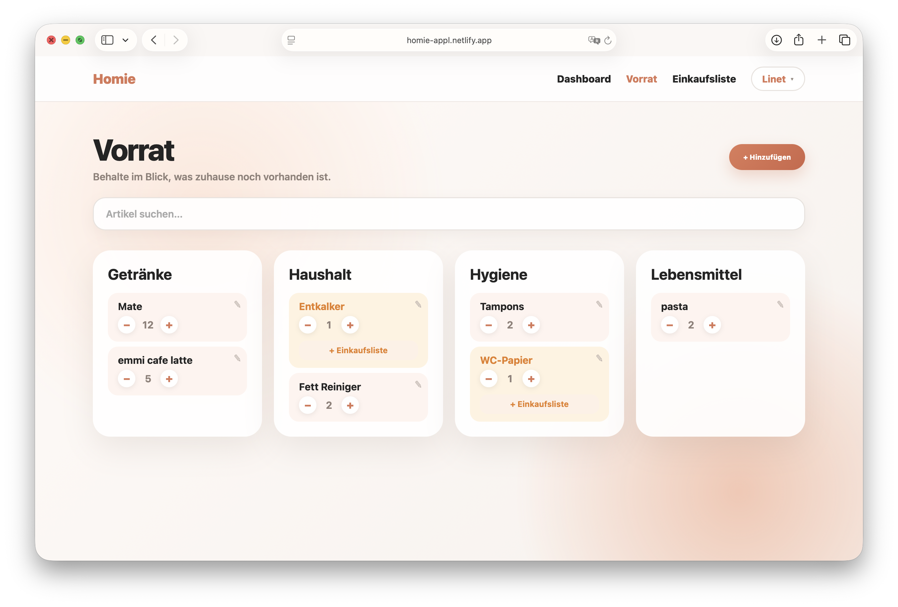
*Übersicht über vorhandene Produkte im Vorrat mit Name, Kategorie und Anzahl.*

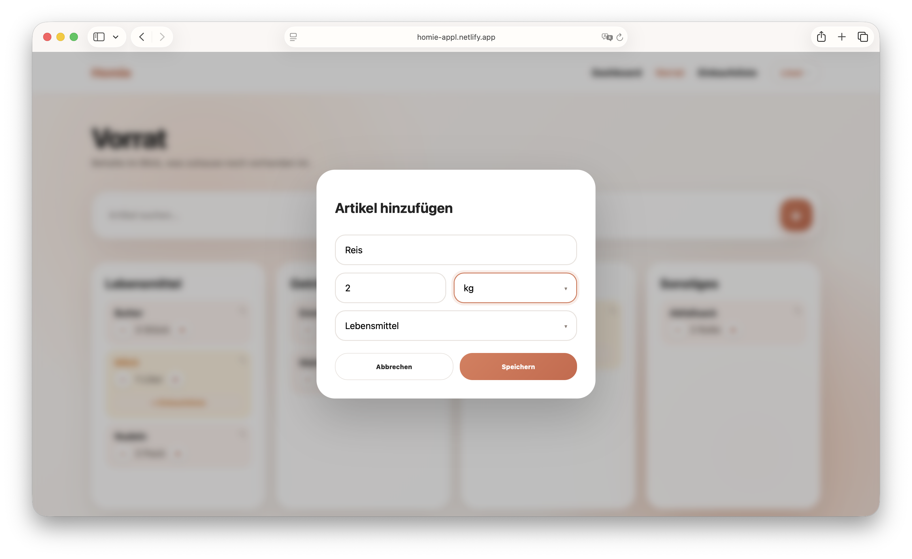
*Maske zum Hinzufügen neuer Produkte in den Vorrat.*

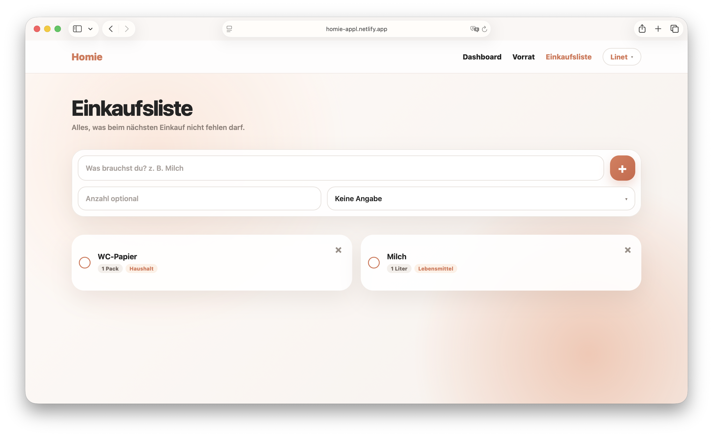
*Einkaufsliste mit fehlenden Produkten, die abgehakt oder verwaltet werden können.*

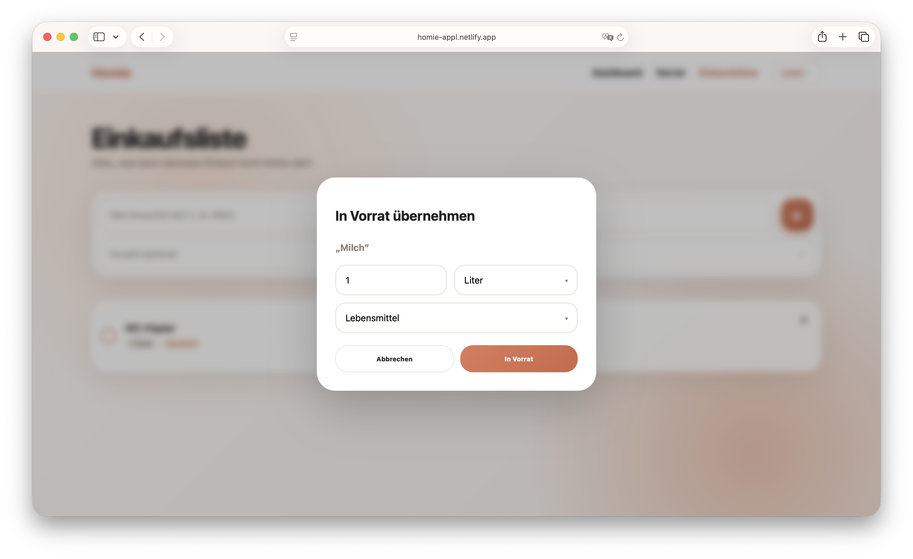
*Ansicht zum Übernehmen oder Aktualisieren von Vorratsprodukten aus der Einkaufsliste, nachdem ein Produkt abgehakt wurde.*

**Designentscheidungen:** Eine zentrale Designentscheidung war die Nutzung eines vierstelligen Haushalts-Codes anstelle eines klassischen Logins. Dadurch können Nutzerinnen und Nutzer schnell starten, ohne ein Konto erstellen zu müssen. Gleichzeitig können mehrere Personen über denselben Code auf denselben Haushalt zugreifen.
Die Bereiche Vorräte, Einkaufsliste, To-do-Liste und Wochenmenüplan wurden klar getrennt, damit keine Verwirrung entsteht. Vorräte zeigen, was bereits vorhanden ist. Die Einkaufsliste zeigt, was noch gekauft werden muss. Die To-do-Liste zeigt offene Aufgaben. Der Wochenmenüplan unterstützt die Planung von Mahlzeiten.
Ausserdem wurde entschieden, Produkte mit Menge und Einheit zu speichern. Dadurch kann genauer nachvollzogen werden, wie viel von einem Produkt vorhanden ist oder gekauft werden muss. Unterstützt werden feste Einheiten wie Stück, Pack, kg, g und Liter sowie eine eigene Angabe.
Wenn die Menge eines Vorratsprodukts niedrig ist, kann es direkt zur Einkaufsliste hinzugefügt werden. Wird ein Produkt in der Einkaufsliste abgehakt, kann es wieder in den Vorrat übernommen werden. Dabei werden Name, Menge, Einheit und Kategorie berücksichtigt.
Beim Wochenmenüplan wurde darauf geachtet, dass Einträge flexibel bearbeitet werden können. Pro Tag können mehrere Gerichte eingetragen werden, und durch Drag & Drop lassen sich Menüeinträge einfach zwischen den Tagen verschieben.
Das visuelle Design wurde bewusst weich und freundlich gestaltet. Abgerundete Karten, warme Farben und klare Abstände sollen dafür sorgen, dass die App übersichtlich wirkt und angenehm zu bedienen ist. Besonders wichtig war auch die mobile Ansicht, da die App häufig im Alltag nebenbei genutzt wird, zum Beispiel beim Einkaufen oder Planen.
Diese Entscheidungen unterstützen das Hauptziel der App: den Haushalt übersichtlich, einfach und gemeinsam zu organisieren.

#### 3.4.2. Umsetzung (Technik)
Der Prototyp wurde als Web-App umgesetzt. Ziel war es, die wichtigsten Funktionen funktionsfähig darzustellen und eine einfache Nutzung für Einzelpersonen sowie gemeinsame Haushalte zu ermöglichen. Die App speichert alle relevanten Daten in einer Datenbank, sodass der aktuelle Stand auch nach dem Neuladen der Seite oder beim erneuten Beitritt zu einem Haushalt erhalten bleibt.
**Technologie-Stack:** Für die Umsetzung wurde SvelteKit verwendet. SvelteKit eignet sich gut für moderne Web-Apps, da Seiten, Serverlogik und Formularaktionen übersichtlich strukturiert werden können. Die App wurde mit HTML, CSS, JavaScript und Svelte umgesetzt. Für die dauerhafte Speicherung der Daten wird MongoDB verwendet.

Verwendete Technologien:
    - SvelteKit
    - JavaScript / Svelte
    - HTML
    - CSS
    - MongoDB

**Tooling:** Für die Entwicklung wurde eine lokale Entwicklungsumgebung verwendet. Der Code wurde in einer IDE bearbeitet und über den lokalen Entwicklungsserver getestet.

Verwendete Tools:
    - Visual Studio Code
    - Terminal
    - Node.js / npm
    - Browser-Entwicklertools zum Testen und Debuggen
    - Git / GitHub zur Versionsverwaltung
    - Netlify

**Struktur & Komponenten:** Die App wurde in mehrere Bereiche und Komponenten aufgeteilt. Dadurch bleibt der Code übersichtlich und die einzelnen Funktionen können einfacher angepasst werden.

Wichtige Bestandteile:
    - Startseite für Haushalts-Code und Haushaltserstellung
    - Dashboard als zentrale Hauptansicht
    - Vorratsbereich zur Verwaltung vorhandener Produkte
    - Einkaufsliste zur Verwaltung fehlender Produkte
    - To-do-Liste für Haushaltsaufgaben
    - Wochenmenüplan für die Essensplanung
    - Formulare zum Hinzufügen neuer Einträge
    - Buttons zum Löschen, Abhaken, Übernehmen oder Verschieben von Einträgen
    - Drag-and-Drop-Funktion zum Verschieben von Menüeinträgen im Wochenmenüplan

Die Navigation ist bewusst einfach gehalten. Nach dem Beitritt zu einem Haushalt befindet sich die Nutzerin oder der Nutzer direkt im Dashboard und kann von dort aus alle Hauptfunktionen verwenden.

**Daten & Schnittstellen:** Alle Daten der App werden in MongoDB gespeichert. Dazu gehören Haushalte, Vorratsprodukte, Einkaufslisten-Einträge, To-do-Einträge und Wochenmenü-Einträge. Der vierstellige Haushalts-Code dient dazu, einem Haushalt beizutreten. Intern werden die gespeicherten Daten dem jeweiligen Haushalt zugeordnet. Wenn mehrere Personen denselben Code verwenden, greifen sie auf dieselben Daten in MongoDB zu.

Für jeden Haushalt werden die relevanten Informationen gespeichert:
    - Haushalts-Code
    - Haushaltsname
    - Vorratsprodukte mit Name, Menge, Einheit und Kategorie
    - Artikel auf der Einkaufsliste mit Name, Menge, Einheit und Kategorie
    - Status von Einkaufslisten-Artikeln, zum Beispiel offen oder erledigt
    - To-do-Einträge
    - Wochenmenü-Einträge pro Kalenderwoche und Wochentag

Die App ruft die Daten aus MongoDB ab und zeigt sie im jeweiligen Bereich an. Wenn ein Produkt, ein Einkaufslisten-Eintrag, eine To-do-Aufgabe oder ein Menüeintrag hinzugefügt wird, wird dieser Eintrag in MongoDB gespeichert. Änderungen wie Löschen, Abhaken, Übernehmen von der Einkaufsliste in den Vorrat oder Verschieben von Menüeinträgen per Drag & Drop werden ebenfalls in MongoDB aktualisiert.
Beim Wochenmenüplan werden die Einträge pro Kalenderwoche gespeichert. Dadurch kann die App die aktuelle Woche anzeigen und alte Menüeinträge automatisch entfernen, wenn sie nicht mehr zur aktuellen Woche gehören.

**Deployment:** https://homie-appl.netlify.app

**Besondere Entscheidungen:** Eine wichtige Entscheidung war der Verzicht auf ein klassisches Login-System. Stattdessen wird ein vierstelliger Haushalts-Code verwendet. Diese Lösung ist einfacher und passt besser zum Ziel der App, da Nutzerinnen und Nutzer möglichst schnell starten können.
Alle Personen mit demselben Haushalts-Code haben dieselben Rechte. Es gibt keine Rollen wie Admin oder Mitglied. Diese Vereinfachung reduziert die Komplexität des Prototyps und macht die Bedienung verständlicher.
Ausserdem wurde entschieden, Mengenangaben und Einheiten bei Vorräten und Einkaufslisten zu speichern. Dadurch bleiben wichtige Informationen erhalten, wenn ein Artikel vom Vorrat auf die Einkaufsliste oder von der Einkaufsliste zurück in den Vorrat übernommen wird.
Beim Wochenmenüplan wurde Drag & Drop umgesetzt, damit Menüeinträge flexibel zwischen den Tagen verschoben werden können. Dies verbessert die Bedienung, da Pläne im Alltag häufig geändert werden.
Der Funktionsumfang wurde bewusst auf die wichtigsten Bereiche begrenzt: Vorräte verwalten, Einkaufsliste nutzen, To-do-Einträge erfassen, Wochenmenü planen und Daten pro Haushalt speichern. Weitere Funktionen wie Benutzerkonten, Barcode-Scan, Rechteverwaltung oder Benachrichtigungen wurden bewusst nicht umgesetzt, da sie den Prototyp komplexer gemacht hätten.
 
### 3.5 Validate
**URL der getesteten Version** https://homie-appl.netlify.app Version vom 20. Mai 2026

**Ziele der Prüfung:** Mit der Validierung sollte überprüft werden, ob der Prototyp verständlich, nützlich und einfach bedienbar ist. Besonders wichtig war die Frage, ob Nutzerinnen und Nutzer die wichtigsten Funktionen ohne lange Erklärung verwenden können. Dabei wurde nicht nur die Verwaltung von Vorräten und Einkaufslisten geprüft, sondern auch das Dashboard, die To-do-Liste und der Wochenmenüplan.

Geprüft wurden folgende Fragen:
- Ist der Einstieg über den Haushalts-Code verständlich?
- Ist klar, wie ein neuer Haushalt erstellt wird?
- Finden Nutzerinnen und Nutzer das Dashboard schnell?
- Ist die Trennung zwischen Vorrat, Einkaufsliste, To-do-Liste und Wochenmenü verständlich?
- Können Produkte einfach hinzugefügt, gelöscht und verwaltet werden?
- Sind Mengenangaben und Einheiten verständlich?
- Ist klar, wie ein Produkt aus dem Vorrat zur Einkaufsliste hinzugefügt werden kann?
- Ist verständlich, dass Einkaufslisten-Produkte wieder in den Vorrat übernommen werden können?
- Können To-do-Einträge einfach erstellt und erledigt werden?
- Ist der Wochenmenüplan verständlich aufgebaut?
- Ist klar, dass mehrere Menüeinträge pro Tag möglich sind?
- Ist klar ersichtlich, ob ein Menüeintrag gespeichert wurde?
- Ist das Verschieben von Menüeinträgen per Drag & Drop verständlich?
- Funktioniert die App auch auf mobilen Geräten übersichtlich?

**Vorgehen:** Die Tests wurden mit einfachen Nutzungsszenarien durchgeführt. Die Testpersonen erhielten konkrete Aufgaben und sollten diese möglichst selbstständig lösen. Währenddessen wurde beobachtet, ob sie die Funktionen finden, verstehen und korrekt verwenden können.
Das Vorgehen war leicht moderiert. Falls eine Testperson nicht weiterkam, wurde notiert, an welcher Stelle das Problem auftrat. Es wurde aber möglichst wenig geholfen, damit sichtbar wurde, ob die App auch ohne Erklärung verständlich ist.

**Stichprobe:** Getestet wurde mit Personen, die zur Zielgruppe der App passen. Dazu gehören Einzelpersonen sowie Personen aus gemeinsamen Haushalten wie WGs, Paarhaushalten oder Familien.

Stichprobe:
    - Anzahl Testpersonen: 6
    - Profil: Einzelpersonen und Personen aus gemeinsamen Haushalten
    - Alter: 25-45 Jahre
    - Technische Erfahrung: gemischt

**Aufgaben/Szenarien:** Für die Validierung wurden typische Alltagssituationen getestet. 
Testaufgaben:
1. Öffne die Web-App.
2. Erstelle einen neuen Haushalt oder tritt einem bestehenden Haushalt mit einem vierstelligen Code bei.
3. Öffne das Dashboard.
4. Füge ein neues Produkt zum Vorrat hinzu.
5. Gib dem Produkt einen Namen, eine Menge, eine Einheit und eine Kategorie.
6. Prüfe, ob das Produkt korrekt im Vorrat angezeigt wird.
7. Füge ein Produkt mit niedriger Menge zur Einkaufsliste hinzu.
8. Prüfe, ob die Mengenangabe in der Einkaufsliste übernommen wurde.
9. Hake ein Produkt in der Einkaufsliste ab.
10. Übernimm ein abgehaktes Produkt wieder in den Vorrat.
11. Erstelle einen Eintrag in der To-do-Liste.
12. Lösche einen nicht mehr benötigten Eintrag.
13. Erstelle einen Eintrag im Wochenmenüplan.
14. Prüfe, ob der Menüeintrag gespeichert und angezeigt wird.
15. Füge für denselben Tag einen weiteren Menüeintrag hinzu.
16. Verschiebe einen Menüeintrag per Drag & Drop auf einen anderen Tag.

**Kennzahlen & Beobachtungen:** Während der Tests wurde beobachtet, ob die Aufgaben erfolgreich abgeschlossen werden konnten und an welchen Stellen Unsicherheiten entstanden.

Beobachtungen:
    - Der Einstieg über den Haushalts-Code wurde grundsätzlich verstanden, jedoch war die Darstellung auf der ersten Seite nicht für alle Testpersonen eindeutig.
    - Einige Testpersonen interpretierten die Zahl „1234“ im Eingabefeld als tatsächlichen Code und dachten, sie müssten genau diesen Code eingeben.
    - Beim Erstellen eines neuen Haushalts war ebenfalls nicht sofort klar, was im ersten Feld erwartet wird, da dort erneut „1234“ angezeigt wurde.
    - Beim zweiten Eingabefeld auf der Seite „Haushalt erstellen“ war für einige Testpersonen unklar, was sie dort eintragen sollen. Erst nach genauerem Hinsehen wurde verstanden, dass damit der Name des Haushalts gemeint ist.
    - Das Dashboard half dabei, die wichtigsten Bereiche schnell zu finden.
    - Die Trennung zwischen Vorrat, Einkaufsliste, To-do-Liste und Wochenmenü war verständlich.
    - Das Hinzufügen von Produkten war einfach nachvollziehbar.
    - Mengenangaben und Einheiten wurden als hilfreich wahrgenommen.
    - Die Übernahme von Artikeln aus dem Vorrat in die Einkaufsliste und zurück in den Vorrat wurde verstanden.
    - Die Speicherung der Daten in MongoDB funktionierte zuverlässig, da Einträge auch nach dem Neuladen der Seite erhalten blieben.
    - Die To-do-Liste wurde als einfache Ergänzung für Haushaltsaufgaben verstanden.
    - Der Wochenmenüplan wurde besonders für Einzelpersonen, Paare und Familien als nützlich wahrgenommen.
    - Beim Wochenmenü war jedoch nicht für alle Testpersonen klar, ob ein eingegebenes Menü wirklich gespeichert wurde. Da es keine eindeutige Bestätigung gab, waren einige unsicher, ob sie noch etwas drücken müssen oder ob der Eintrag automatisch übernommen wurde.
    - In WGs wurde der Wochenmenüplan weniger zentral bewertet, da dort viele Personen ihre Mahlzeiten individuell planen.
    - Das Verschieben von Menüeinträgen per Drag & Drop wurde positiv wahrgenommen, musste aber klar funktionieren, damit keine Einträge doppelt erscheinen.
    - Die mobile Nutzung ist wichtig, weil die Einkaufsliste oft direkt beim Einkaufen verwendet wird.
    - Bei gemeinsamen Haushalten war nicht klar ersichtlich, welche Person einen Eintrag erstellt hat. Dadurch kann es schwierig sein nachzuvollziehen, wer ein Produkt, einen Einkaufslisten-Eintrag oder eine To-do-Aufgabe hinzugefügt hat.

Kennzahlen:
    - Erfolgsquote: 16 von 16 Aufgaben erfolgreich gelöst
    - Durchschnittlicher Zeitbedarf: 3–6 Minuten pro Testperson
    - Häufigste Schwierigkeit: Die Platzhaltertexte „1234“ und „z. B. WG Zürich“ waren nicht für alle Testpersonen eindeutig. Zusätzlich war beim Wochenmenü nicht immer klar ersichtlich, ob ein Menüeintrag gespeichert wurde.

**Zusammenfassung der Resultate:** Die Validierung zeigte, dass die Grundidee von Homie verständlich ist und die wichtigsten Funktionen sinnvoll zusammenarbeiten. Besonders positiv bewertet wurden das übersichtliche Dashboard, die klare Aufteilung in Vorrat, Einkaufsliste, To-do-Liste und Wochenmenü sowie die zuverlässige Speicherung der Daten in MongoDB.
Alle getesteten Aufgaben konnten erfolgreich abgeschlossen werden. Die App wurde als alltagstauglich wahrgenommen, besonders für das schnelle Erfassen von Vorräten, das Verwalten einer Einkaufsliste und die Planung von Aufgaben oder Mahlzeiten.
Beim Einstieg in die App zeigte sich jedoch, dass die Eingabefelder noch klarer beschriftet werden sollten. Einige Testpersonen verstanden den Platzhalter "1234" als tatsächlichen Code und waren unsicher, ob sie genau diese Zahl eingeben müssen. Auch beim Erstellen eines Haushalts war nicht sofort klar, was im ersten und zweiten Feld eingetragen werden soll. Besonders das zweite Feld sollte deutlicher als Haushaltsname erkennbar sein.
Beim Wochenmenü wurde ausserdem festgestellt, dass nicht immer klar war, ob ein eingetragener Menüpunkt gespeichert wurde. Einige Testpersonen waren unsicher, ob sie nach der Eingabe noch eine zusätzliche Aktion ausführen müssen. Eine klare Rückmeldung, zum Beispiel durch eine kurze Speicherbestätigung oder eine deutlichere Anzeige des gespeicherten Eintrags, würde hier helfen.
Verbesserungspotenzial gibt es ausserdem bei der Nutzung in gemeinsamen Haushalten wie WGs oder Familien. Dort wäre es hilfreich, wenn sichtbar wäre, welche Person einen Eintrag erstellt hat. Zusätzlich wurde von Testpersonen der Wunsch geäussert, dass die App in Zukunft Rezeptvorschläge machen soll. Diese Rezeptvorschläge sollen auf den Produkten basieren, die bereits im Vorrat vorhanden sind.

**Abgeleitete Verbesserungen:** Aus der Validierung wurden mehrere Verbesserungen abgeleitet, die in einer nächsten Version umgesetzt werden sollten.

1. Klarere Beschriftung der Eingabefelder beim Einstieg
Auf der Startseite sollte deutlicher erkennbar sein, dass im Feld ein individueller Haushalts-Code eingegeben werden muss. Der Platzhalter "1234" kann missverständlich sein, da einige Testpersonen dachten, sie müssten genau diesen Code eingeben. Eine klarere Beschriftung wie "Haushalts-Code eingeben" oder ein erklärender Hinweis unter dem Feld würde die Nutzung verständlicher machen.
2. Klarere Felder beim Haushalt-Erstellen
Beim Erstellen eines Haushalts sollte besser erklärt werden, was in die Eingabefelder gehört. Das Feld mit "1234" sollte klar als automatisch generierter oder selbst gewählter Haushalts-Code erkennbar sein. Das zweite Feld sollte deutlicher als Haushaltsname beschriftet werden, zum Beispiel mit "Name deines Haushalts" statt nur einem Beispiel wie "z. B. WG Zürich".
3. Deutlichere Rückmeldung beim Wochenmenü
Beim Wochenmenü sollte klarer angezeigt werden, ob ein Menüeintrag gespeichert wurde. Eine kurze Bestätigung wie "Gespeichert" oder eine sichtbare Änderung des Eintrags nach dem Hinzufügen würde den Nutzerinnen und Nutzern mehr Sicherheit geben. Dadurch wäre besser verständlich, ob der Eintrag erfolgreich übernommen wurde oder ob noch eine weitere Aktion nötig ist.
4. Anzeige, wer einen Eintrag erstellt hat
In gemeinsamen Haushalten wie WGs oder Familien wäre es hilfreich zu sehen, welche Person einen Eintrag erstellt hat. So könnten Haushaltsmitglieder besser nachvollziehen, wer ein Produkt zur Einkaufsliste hinzugefügt, eine Aufgabe erstellt oder einen Vorratsartikel eingetragen hat. Das würde die Transparenz und Kommunikation im Haushalt verbessern.
5. Rezeptvorschläge anhand vorhandener Vorräte
Nutzerinnen und Nutzer wünschten sich eine Funktion, mit der aus vorhandenen Produkten passende Rezeptideen vorgeschlagen werden. Dadurch könnte die App nicht nur beim Einkaufen helfen, sondern auch dabei, vorhandene Lebensmittel sinnvoll zu verwenden und Lebensmittelverschwendung zu reduzieren.

## 4. Erweiterungen

Die ersten drei Verbesserungen wurden im Rahmen des Prototyps direkt berücksichtigt. Die Anzeige der erstellenden Person sowie Rezeptvorschläge bleiben als mögliche Weiterentwicklungen offen.

### 4.1 Klarere Eingabefelder beim Einstieg
**Beschreibung & Nutzen:** Nach der Evaluation wurden die Eingabefelder auf der Startseite verständlicher gestaltet. In den Tests zeigte sich, dass einige Testpersonen den Platzhalter „1234“ als echten Code interpretierten und dachten, sie müssten genau diese Zahl eingeben. Dadurch entstand Unsicherheit beim Beitritt zu einem bestehenden Haushalt.
Um dieses Problem zu reduzieren, wurde die Beschriftung beziehungsweise Darstellung des Eingabefeldes angepasst. Nutzerinnen und Nutzer sollen nun besser verstehen, dass sie dort den individuellen Haushalts-Code eingeben müssen, den sie von einem bestehenden Haushalt erhalten haben.
Diese Anpassung verbessert den Einstieg in die App, weil die erste Interaktion klarer ist und weniger Erklärung benötigt wird.

**Wo umgesetzt:**
**Frontend:** Anpassung der Startseite mit klarerer Beschriftung des Code-Feldes und verständlicherem Hinweistext
**Backend:** Keine Änderung notwendig, da sich die Logik zum Beitritt über den Haushalts-Code nicht verändert hat
**Datenbank:** Keine Änderung notwendig, da weiterhin die bestehende Haushalts-ID beziehungsweise der Haushalts-Code verwendet wird

**Referenz:** 
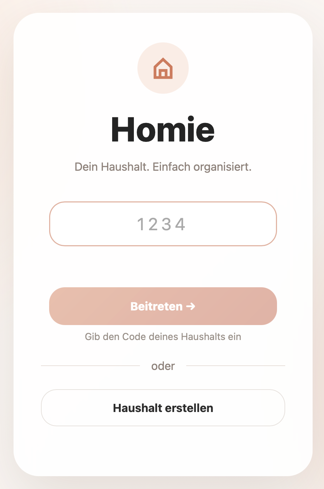

**Aus Evaluation abgeleitet?:** Ja. Die Erweiterung wurde direkt aus der Evaluation abgeleitet, weil mehrere Testpersonen durch den Platzhalter "1234" unsicher waren und nicht sofort verstanden, welchen Code sie eingeben sollen.

### 4.2 Verständlichere Erstellung eines Haushalts
**Beschreibung & Nutzen:** Auch beim Erstellen eines neuen Haushalts wurde nach der Evaluation deutlich, dass die Eingabefelder nicht eindeutig genug waren. Einige Testpersonen wussten nicht genau, was sie in das erste Feld eingeben sollen, weil dort ebenfalls „1234“ stand. Zusätzlich war beim zweiten Feld nicht sofort klar, dass dort der Name des Haushalts eingetragen werden soll.
Deshalb wurde die Seite zum Erstellen eines Haushalts verständlicher gestaltet. Das Feld für den Haushalts-Code und das Feld für den Haushaltsnamen sollen nun klarer voneinander unterscheidbar sein. Dadurch verstehen Nutzerinnen und Nutzer besser, welche Informationen benötigt werden, um einen neuen Haushalt anzulegen.
Diese Verbesserung erleichtert besonders neuen Nutzerinnen und Nutzern den Einstieg, da sie ohne zusätzliche Erklärung einen Haushalt erstellen können.

**Wo umgesetzt:**
**Frontend:** Anpassung der Seite „Haushalt erstellen“ mit klareren Feldbeschriftungen und verständlicheren Platzhaltern
**Backend:** Die bestehende Logik zum Erstellen eines Haushalts wurde beibehalten
**Datenbank:** Keine strukturelle Änderung notwendig, da Haushalts-Code und Haushaltsname bereits gespeichert werden

**Referenz:**
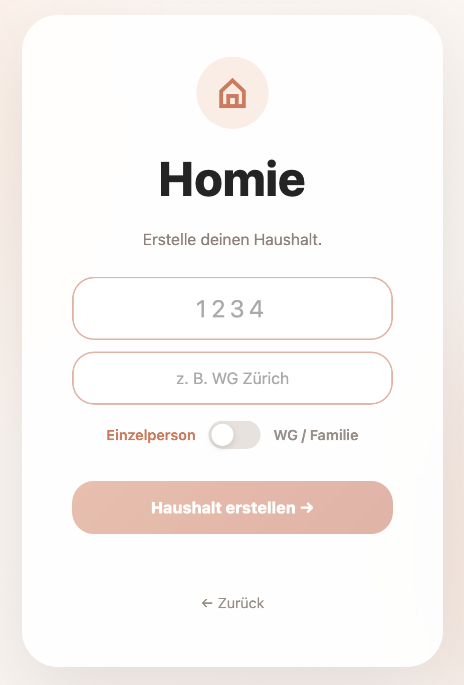

**Aus Evaluation abgeleitet?:** Ja. Die Erweiterung wurde aus der Evaluation abgeleitet, weil Testpersonen nicht eindeutig verstanden, was in die Felder "1234" und "z. B. WG Zürich" eingetragen werden soll.

### 4.3 Deutlichere Rückmeldung beim Wochenmenü
**Beschreibung & Nutzen:** Beim Wochenmenü zeigte die Evaluation, dass nicht für alle Testpersonen klar war, ob ein eingegebener Menüeintrag gespeichert wurde. Einige waren unsicher, ob sie nach der Eingabe noch eine weitere Aktion ausführen müssen oder ob der Eintrag automatisch übernommen wurde.
Deshalb wurde die Rückmeldung beim Wochenmenü verbessert. Nutzerinnen und Nutzer sollen klar erkennen, ob ein Menüeintrag erfolgreich gespeichert wurde. Dies kann zum Beispiel durch eine sichtbare Aktualisierung des Eintrags, eine kurze Bestätigung oder eine eindeutigere Speicherlogik erfolgen.
Diese Anpassung erhöht die Sicherheit bei der Nutzung des Wochenmenüplans und verhindert, dass Nutzerinnen und Nutzer Einträge mehrfach erfassen oder unsicher abbrechen.

**Wo umgesetzt:**
**Frontend:** Anpassung der Wochenmenü-Komponente mit klarerer Anzeige gespeicherter Menüeinträge und verständlicherem Verhalten nach der Eingabe
**Backend:** SvelteKit Form Actions zum Speichern, Aktualisieren und Verschieben von Menüeinträgen
**Datenbank:** MongoDB-Collection "wochenmenu", in der Menüeinträge pro Haushalt, Kalenderwoche und Wochentag gespeichert werden

**Referenz:**
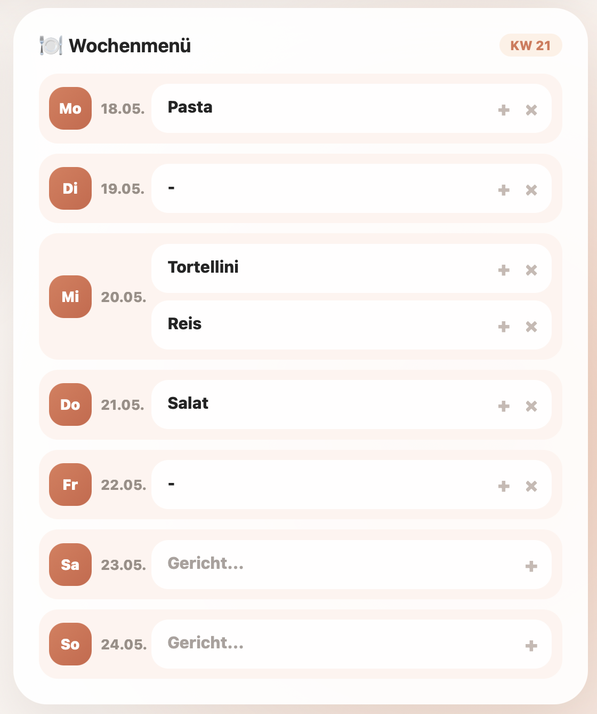

**Aus Evaluation abgeleitet?:** Ja. Die Erweiterung wurde aus der Evaluation abgeleitet, weil Testpersonen nicht eindeutig erkennen konnten, ob ein Menüeintrag gespeichert wurde.

### 4.4 Verknüpfung Einkaufsliste ↔ Vorrat
**Beschreibung & Nutzen:** Artikel aus dem Vorrat können direkt zur Einkaufsliste hinzugefügt werden, sobald die Menge niedrig ist. Umgekehrt kann ein Artikel aus der Einkaufsliste nach dem Einkauf wieder in den Vorrat übernommen werden. Dabei werden Name, Menge, Einheit und Kategorie mitgeführt. Dadurch müssen Nutzerinnen und Nutzer dieselben Informationen nicht mehrfach eingeben.

Diese Erweiterung bildet den realen Ablauf im Haushalt besser ab: Ein Produkt wird zuerst im Vorrat erfasst, bei Bedarf auf die Einkaufsliste gesetzt und nach dem Einkauf wieder in den Vorrat übernommen. Dadurch entsteht ein geschlossener Workflow zwischen Vorratsverwaltung und Einkaufsliste.

**Wo umgesetzt:**
**Frontend:** Vorrat-Seite mit Button „+ Einkaufsliste“; Einkaufsliste mit Modal „In Vorrat übernehmen“
**Backend:** SvelteKit Form Actions zum Hinzufügen von Vorratsartikeln zur Einkaufsliste und zum Übernehmen von Einkaufslisten-Artikeln zurück in den Vorrat
**Datenbank:** MongoDB-Collections "vorrat" und "einkaufsliste", verknüpft über die Haushalts-ID

**Referenz:** Beschrieben in Kapitel 3.3 bei der User Journey sowie in Kapitel 3.4.1 bei den Screenshots zur Vorratsübersicht, Einkaufsliste und Übernahme in den Vorrat.

**Aus Evaluation abgeleitet?:** Nein. Die Funktion entstand nicht direkt aus der Evaluation, sondern wurde bereits während der Konzeption und Umsetzung als sinnvoller Bestandteil der App geplant. Die Evaluation hat jedoch bestätigt, dass diese Verknüpfung für den Alltag nützlich ist, da Nutzerinnen und Nutzer Artikel nicht doppelt erfassen müssen und der Ablauf zwischen Vorrat und Einkaufsliste verständlich ist.

### 4.5 Mengenangaben und Einheiten
**Beschreibung & Nutzen:** Die App wurde so erweitert, dass Produkte nicht nur mit einem Namen gespeichert werden, sondern zusätzlich mit Menge und Einheit. Nutzerinnen und Nutzer können dadurch genauer festhalten, wie viel von einem Produkt vorhanden ist oder gekauft werden muss. Unterstützt werden feste Einheiten wie Stück, Pack, kg, g und Liter sowie eine eigene Angabe.

Besonders wichtig ist, dass Mengenangaben und Einheiten beim Wechsel zwischen Vorrat und Einkaufsliste erhalten bleiben. Wenn ein Artikel aus dem Vorrat zur Einkaufsliste hinzugefügt wird, werden Menge und Einheit mitgespeichert. Wird ein gekaufter Artikel später von der Einkaufsliste wieder in den Vorrat übernommen, werden diese Angaben ebenfalls übernommen. Dadurch müssen Nutzerinnen und Nutzer die gleichen Informationen nicht erneut eingeben.

Diese Erweiterung macht die Vorrats- und Einkaufslistenfunktion deutlich alltagstauglicher. Es reicht nicht immer zu wissen, dass ein Produkt vorhanden ist oder gekauft werden muss. Oft ist auch wichtig, ob zum Beispiel eine Packung, ein Kilogramm oder ein Liter benötigt wird.

**Wo umgesetzt:**
**Frontend:** Eingabefelder und Auswahlfelder für Menge und Einheit auf der Vorrat-Seite und der Einkaufsliste; Möglichkeit für eine eigene Einheit
**Backend:** SvelteKit Form Actions zum Speichern und Aktualisieren von Menge und Einheit bei Vorratsartikeln und Einkaufslisten-Einträgen; Menge und Einheit werden beim Übernehmen zwischen Vorrat und Einkaufsliste mitgegeben
**Datenbank:** Felder "menge" und "einheit" in den MongoDB-Collections "vorrat" und "einkaufsliste"

**Referenz:** Die Mengenangaben und Einheiten werden in Kapitel 3.3 bei der User Journey sowie in Kapitel 3.4.1 in den Screenshots zur Vorratsübersicht, zum Hinzufügen von Vorratsartikeln und zur Einkaufsliste beschrieben.

**Aus Evaluation abgeleitet?:** Nein. Die Funktion entstand bereits während der Weiterentwicklung, weil eine reine Artikelliste für den Alltag nicht genau genug ist. Die Evaluation hat jedoch bestätigt, dass Mengenangaben und Einheiten hilfreich sind und die Nutzung verständlicher machen.

### 4.6 Wochenmenüplan mit mehreren Einträgen und Drag & Drop
**Beschreibung & Nutzen:** Die App wurde um einen Wochenmenüplan erweitert, der direkt auf dem Dashboard angezeigt wird. Nutzerinnen und Nutzer können dadurch ihre geplanten Mahlzeiten direkt in der zentralen Übersicht erfassen und bearbeiten, ohne zuerst auf eine separate Seite wechseln zu müssen. Der Wochenmenüplan bezieht sich immer auf die aktuelle Kalenderwoche. Sobald eine neue Woche beginnt, wird eine leere neue Woche angezeigt und alte Wochenmenüeinträge werden aus der Datenbank entfernt.
Für jeden Wochentag können Mahlzeiten eingetragen werden. Pro Tag können mehrere Menüeinträge erstellt werden, zum Beispiel für Mittag- und Abendessen. Zusätzlich können Menüeinträge per Drag & Drop zwischen den Tagen verschoben werden.
Diese Erweiterung unterstützt die Essensplanung und hilft dabei, Einkäufe besser vorzubereiten und vorhandene Lebensmittel gezielter zu verwenden. Besonders für Einzelpersonen, Paare oder Familien kann der Wochenmenüplan helfen, den Alltag besser zu strukturieren.

**Wo umgesetzt:**
**Frontend:** Wochenmenü-Karte direkt auf dem Dashboard mit Anzeige der aktuellen Kalenderwoche, Eingabefeldern pro Wochentag, Plus-Button für zusätzliche Menüeinträge und Drag-&-Drop-Funktion
**Backend:** SvelteKit Form Actions zum Speichern, Löschen, Aktualisieren und Verschieben von Menüeinträgen; automatische Berechnung der aktuellen Kalenderwoche
**Datenbank:** MongoDB-Collection "wochenmenu", gespeichert pro Haushalt, Kalenderwoche und Wochentag, alte Wochenmenüeinträge werden nach Ende der Woche gelöscht

**Referenz:**  Der Wochenmenüplan wird in Kapitel 3.3 bei der User Journey sowie in Kapitel 3.4.1 im Dashboard und im Screenshot des Wochenmenüplans beschrieben.
 
**Aus Evaluation abgeleitet?:** Teilweise. Der Wochenmenüplan entstand bereits während der Weiterentwicklung, weil Haushaltsorganisation nicht nur Vorräte und Einkäufe umfasst, sondern auch die Planung von Mahlzeiten. In der Evaluation wurde bestätigt, dass diese Funktion besonders für Einzelpersonen, Paare und Familien nützlich ist. Gleichzeitig zeigte die Evaluation, dass die Rückmeldung beim Speichern von Menüeinträgen klarer gestaltet werden sollte.

## 5. Projektorganisation
**Repository & Struktur:** https://github.com/vadaclin/homie
Das Repository enthält die zentrale SvelteKit-Projektstruktur. Im Ordner src befinden sich die Seiten, Server-Logik und wiederverwendbare Bestandteile der Web-App. Der Ordner static enthält statische Dateien wie Bilder oder Icons. Zusätzlich gibt es verschiedene Konfigurationsdateien, zum Beispiel für SvelteKit, Vite und Netlify.
Die Struktur des Projekts ist so aufgebaut, dass die wichtigsten Bereiche der App klar voneinander getrennt sind. Die einzelnen Routen wie Dashboard, Vorrat, Einkaufsliste und Haushaltserstellung sind jeweils in eigenen Ordnern abgelegt. Dadurch bleibt der Code übersichtlich und die Weiterentwicklung einzelner Funktionen ist einfacher möglich.

**Commit-Praxis:** Die Entwicklung wurde mit Git und GitHub versioniert. Änderungen wurden regelmässig committed, sodass die Entstehung des Prototyps grundsätzlich nachvollziehbar ist. Die Commits dokumentieren verschiedene Entwicklungsschritte, zum Beispiel den Aufbau der Grundstruktur, die Umsetzung einzelner Funktionen, Designanpassungen sowie Fehlerbehebungen.
Die Commit-Nachrichten waren teilweise beschreibend, jedoch nicht immer einheitlich oder sehr detailliert. Dadurch lässt sich der allgemeine Entwicklungsverlauf erkennen, auch wenn nicht jeder einzelne Commit exakt beschreibt, welche Änderung vorgenommen wurde.

## 6. KI-Deklaration
Die folgende Deklaration ist verpflichtend und beschreibt den Einsatz von KI im Projekt.

### 6.1 KI-Tools
**Eingesetzte Tools**: Für das Projekt wurden ChatGPT und Claude eingesetzt.

**Zweck & Umfang**: Die KI-Tools wurden vor allem zur Unterstützung bei der Umsetzung des Codes, bei der Fehlersuche, beim Refactoring und bei der Formulierung von Texten verwendet. Dazu gehörten unter anderem Vorschläge für SvelteKit-Code, Server Actions, MongoDB-Abfragen, CSS-Anpassungen und responsive Design-Anpassungen.

Ein grosser Teil des Codes wurde mithilfe von KI-Unterstützung erstellt oder überarbeitet. Die KI wurde dabei nicht nur für einzelne Codezeilen genutzt, sondern auch für grössere zusammenhängende Funktionen, zum Beispiel für die Vorratsverwaltung, Einkaufsliste, Dashboard-Ansicht, To-do-Liste und den Wochenmenüplan.

**Eigene Leistung (Abgrenzung):**  Die Grundidee der App, die Projektanforderungen, die gewünschte Funktionalität und die Entscheidungen zur Gestaltung wurden selbst erarbeitet. Die Ordnerstruktur des SvelteKit-Projekts wurde selbst angelegt und verwaltet. Anschliessend wurde der KI jeweils erklärt, welche Datei oder Funktion angepasst werden soll.

Die KI-Ausgaben wurden nicht ungeprüft übernommen. Der Code wurde getestet, angepasst und bei Fehlern schrittweise verbessert. Besonders bei der visuellen Gestaltung wurden die Ergebnisse im Browser überprüft und mit Screenshots oder Beschreibungen weiter angepasst. Auch die Entscheidung, welche Funktionen in die App aufgenommen werden, wurde selbst getroffen.

### 6.2 Prompt-Vorgehen
Beim Prompting wurde meist sehr konkret gearbeitet. Es wurde beschrieben, welche Funktion umgesetzt werden soll, in welcher Datei sich der Code befindet und welches Verhalten erwartet wird. Häufig wurden bestehende Codeausschnitte eingefügt, damit die KI den aktuellen Stand berücksichtigen konnte. Anschliessend wurden die Vorschläge getestet und bei Problemen erneut mit Fehlermeldungen oder Screenshots zurückgegeben.

Das Vorgehen war iterativ. Besonders bei CSS- und Layout-Fragen wurden mehrere Anpassungen ausprobiert, weil visuelle Details nicht immer direkt korrekt umgesetzt wurden. Beispiele dafür waren die mobile Ansicht, die Ausrichtung von Texten im Wochenmenüplan oder die Grösse der weissen Box beim Eingeben beziehungsweise Erstellen eines Haushalts-Codes.

ChatGPT und Claude waren beide hilfreich. Bei reinem Code oder Textentwürfen lieferten beide Tools meistens gute Ergebnisse. Bei visuellen Anpassungen gab es jedoch Unterschiede. Ein Beispiel war die weisse Box beim Haushalts-Code eingeben und beim Haushalts-Code erstellen: Die Boxen sollten gleich gross und optisch einheitlich sein. Claude konnte dieses Layoutproblem nicht zufriedenstellend lösen, während ChatGPT eine passende Lösung liefern konnte.

Beim Umgang mit KI wurde darauf geachtet, keine fremden geschützten Inhalte direkt zu übernehmen. Die KI wurde vor allem für eigene Projekttexte, Codevorschläge und Verbesserungen auf Basis des eigenen Projekts verwendet.

### 6.3 Reflexion
Der Einsatz von KI war für das Projekt sehr hilfreich. Besonders bei der Umsetzung mit SvelteKit, MongoDB und CSS konnten Probleme schneller gelöst werden. Die KI half dabei, Code zu strukturieren, Fehler zu finden und bestehende Funktionen zu erweitern.

Ein grosser Vorteil war, dass Fehlermeldungen direkt analysiert und mögliche Lösungen vorgeschlagen werden konnten. Dadurch konnten Probleme schrittweise behoben werden. Auch bei neuen Funktionen wie dem Wochenmenüplan, Drag & Drop oder der Verknüpfung zwischen Vorrat und Einkaufsliste war die KI eine grosse Unterstützung.

Gleichzeitig zeigte sich, dass KI-Ergebnisse immer überprüft werden müssen. Nicht jeder Vorschlag funktionierte sofort. Teilweise wurden Funktionen vorgeschlagen, die nicht zur vorhandenen Struktur passten oder neue Fehler verursachten. Besonders bei visuellen Details musste viel getestet und nachkorrigiert werden. Die KI konnte zwar Code liefern, aber die finale Kontrolle im Browser und die Entscheidung, ob das Ergebnis wirklich passt, musste selbst erfolgen.

Insgesamt war KI ein wichtiges Hilfsmittel, ersetzte aber nicht das eigene Verständnis des Projekts. Die Anforderungen, die Struktur, das Testen, die Auswahl der passenden Lösungen und die finale Bewertung der App blieben eigene Leistungen.
